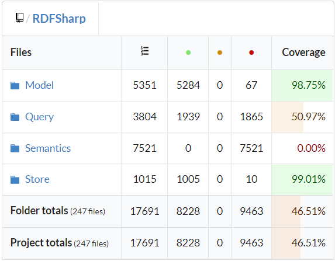

# Egységtesztek kiegészítése és tesztek kódlefedettségének mérése

A feladatot a codecov kódfedettseg mérő beüzemelésével kezdtem.
Az eszközt Github Actionbe is bekötöttem, így minden push után 
friss információt kapunk az aktuális kódfedettségről.

Az `RDFSelectQuery` és `RDFConstructQuery` osztályokat teszteltem.
A tesztek során a projektben korábban használt framewörköt alkalmaztam. (MSTest és WireMockServer)

A következő teszteseteket hoztam létre:
- `ShouldCreateConstructQuery`: Inicializált RDFConstructQuery vizsgálata.
- `ShouldCreateConstructQueryWithQueryMembers`: RDFConstructQuery helyes SPARQL reprezentációjának vizsgálata.
- `ShouldApplyConstructQueryToSPARQLEndpoint`: SPARQL végponttól construct queryre kapott válasz helyes szerializációjának vizsgálata. Ehhez mock szerver objektumot hoztam létre.
- `ShouldCreateSelectQuery`: Inicializált RDFSelectQuery vizsgálata.
- `ShouldCreateSelectQueryWithQueryMembers`: RDFSelectQuery helyes SPARQL reprezentációjának vizsgálata.
- `ShouldApplySelectQueryToSPARQLEndpoint`: SPARQL végponttól select queryre kapott válasz helyes szerializációjának vizsgálata. Ehhez mock szerver objektumot hoztam létre.

A `ShouldCreateSelectQueryWithQueryMembers` teszt elbukott. A hibát felvettem egy issueba.
A coverage láthatósága miatt a tesztet kikommenteztem átmenetileg.
